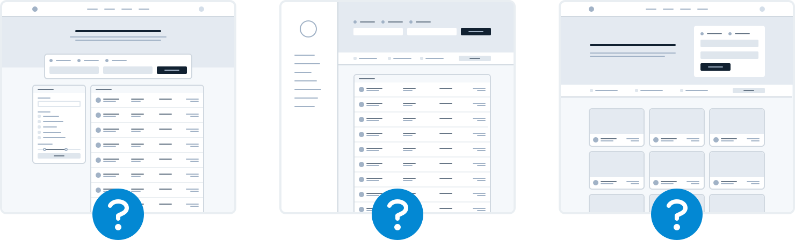

# 从零开始

## 从功能开始，而不是布局

当您开始设计新的应用程序创意时，您首先设计什么？如果它是页面顶部的导航栏，那么您就犯了一个错误。

在进行新设计时，发现自己感到沮丧和陷入困境的最简单方法就是从尝试“设计应用程序”开始。当大多数人考虑“设计应用程序”时，他们想到的是外壳。

它应该有顶部导航还是侧边栏？

导航项应该在左侧还是右侧？

页面内容应该在容器中，还是应该是全角的？

logo 应该放在哪里？

问题是，“应用程序”实际上是功能的集合。在设计一些功能之前，您甚至没有决定导航如何工作所需的信息。难怪令人沮丧！

不要从 shell 开始，而是从实际功能开始。

例如，假设您正在构建航班预订服务。您可以从“搜索航班”等功能开始。

您的界面将需要：

- 出发城市字段
- 目的地城市字段
- 出发日期字段
- 返回日期字段
- 执行搜索的按钮

从这些地方开始更理想。

天哪，你可能甚至不需要其他东西——它对谷歌有用。

##
