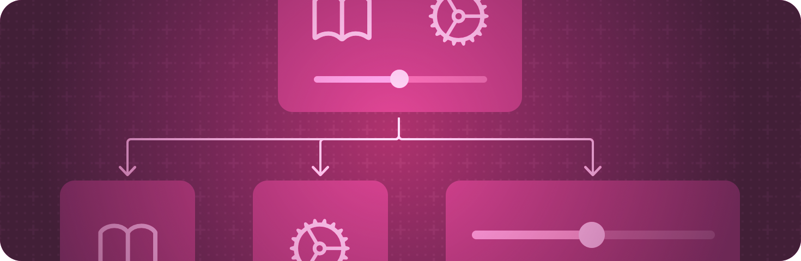

# View fundamentals View 基础知识

Define the visual elements of your app using a hierarchy of views.
使用视图层次结构定义应用的视觉元素。

## Overview 概述

Views are the building blocks that you use to declare your app’s user interface. Each view contains a description of what to display for a given state. Every bit of your app that’s visible to the user derives from the description in a view, and any type that conforms to the View protocol can act as a view in your app.
视图是用于声明应用程序用户界面的构建块。每个视图都包含对给定状态要显示的内容的描述。用户可以看到的应用中的每一个比特都源自视图中的描述，任何符合 View 协议的类型都可以充当应用中的视图。


Compose a custom view by combining built-in views that SwiftUI provides with other custom views that you create in your view’s body computed property. Configure views using the view modifiers that SwiftUI provides, or by defining your own view modifiers using the ViewModifier protocol and the `modifier(_:)` method.
通过将 SwiftUI 提供的内置视图与您在视图的 body computed 属性中创建的其他自定义视图相结合，来编写自定义视图。使用 SwiftUI 提供的视图修饰符配置视图，或者通过使用视图修饰符协议和 modifier（\_：） 方法定义您自己的视图修饰符来配置视图。

## Topics 主题

### ViewModifier ViewModifier 视图修改器

A modifier that you apply to a view or another view modifier, producing a different version of the original value.
应用于视图或其他视图修饰符的修饰符，用于生成原始值的不同版本。

```swift
@MainActor @preconcurrency
protocol ViewModifier
```

### Overview 概述

Adopt the ViewModifier protocol when you want to create a reusable modifier that you can apply to any view. The example below combines several modifiers to create a new modifier that you can use to create blue caption text surrounded by a rounded rectangle:
当您想要创建可应用于任何视图的可重用修饰符时，请采用 ViewModifier 协议。下面的示例将多个修饰符组合在一起，创建一个新修饰符，您可以使用该修饰符创建由圆角矩形包围的蓝色字幕文本：

```swift
struct BorderedCaption: ViewModifier {
    func body(content: Content) -> some View {
        content
            .font(.caption2)
            .padding(10)
            .overlay(
                RoundedRectangle(cornerRadius: 15)
                    .stroke(lineWidth: 1)
            )
            .foregroundColor(Color.blue)
    }
}
```

You can apply `modifier(_:)` directly to a view, but a more common and idiomatic approach uses modifier(_:) to define an extension to View itself that incorporates the view modifier:
你可以将 modifier（_：） 直接应用于视图，但更常见和惯用的方法是使用 modifier（\_：） 来定义 View 本身的扩展，该扩展包含视图修饰符：

```swift
extension View {
    func borderedCaption() -> some View {
        modifier(BorderedCaption())
    }
}
```

You can then apply the bordered caption to any view, similar to this:
然后，您可以将带边框的标题应用于任何视图，类似于：

```swift
Image(systemName: "bus")
    .resizable()
    .frame(width:50, height:50)
Text("Downtown Bus")
    .borderedCaption()
```
