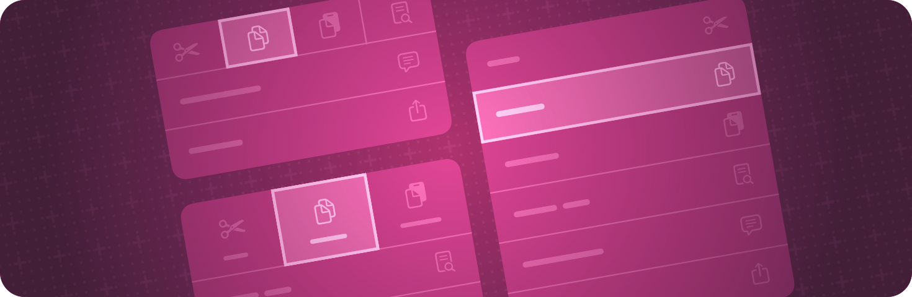

# View styles 视图样式

Apply built-in and custom appearances and behaviors to different types of views.

将内置和自定义外观和行为应用于不同类型的视图。

## Overview 概述

SwiftUI defines built-in styles for certain kinds of views and automatically selects the appropriate style for a particular presentation context. For example, a Label might appear as an icon, a string title, or both, depending on factors like the platform, whether the view appears in a toolbar, and so on.

SwiftUI 为某些类型的视图定义内建样式，并自动为特定演示文稿上下文选择合适的样式。例如，Label 可能显示为图标或字符串标题，具体取决于平台、视图是否显示在工具栏中等因素。


You can override the automatic style by using one of the style view modifiers. These modifiers typically propagate throughout a container view, so that you can wrap a view hierarchy in a style modifier to affect all the views of the given type within the hierarchy.

您可以使用其中一个样式视图修饰符来覆盖自动样式。这些修饰符通常传播到整个容器视图中，以便您可以将视图层次结构包装在样式修饰符中，以影响层次结构中给定类型的所有视图。

Any of the style protocols that define a makeBody(configuration:) method, like ToggleStyle, also enable you to define custom styles. Create a type that conforms to the corresponding style protocol and implement its makeBody(configuration:) method. Then apply the new style using a style view modifier exactly like a built-in style.

任何定义 `makeBody(configuration：)` 方法的样式协议（如 ToggleStyle）也允许您定义自定义样式。创建一个符合相应样式协议的类型，并实现其 `makeBody(configuration：)` 方法。然后，使用样式视图修饰符应用新样式，就像使用内置样式一样。

## Topics 主题

### Styling buttons 设置按钮样式

#### `func buttonStyle(_:)`

```swift
nonisolated
func buttonStyle<S>(_ style: S) -> some View where S : ButtonStyle
```

Sets the style for buttons within this view to a button style with a custom appearance and standard interaction behavior.
将此视图中的按钮样式设置为具有自定义外观和标准交互行为的按钮样式。

**Discussion 讨论**

Use this modifier to set a specific style for all button instances within a view:
使用此修饰符可为视图中的所有 button 实例设置特定样式：

```swift
HStack {
    Button("Sign In", action: signIn)
    Button("Register", action: register)
}
.buttonStyle(.bordered)
```

You can also use this modifier to set the style for controls that acquire a button style through composition, like the Menu and Toggle views in the following example:
您还可以使用此修饰符为通过组合获取按钮样式的控件设置样式，如以下示例中的 Menu 和 Toggle 视图：

```swift
VStack {
    Menu("Terms and Conditions") {
        Button("Open in Preview", action: openInPreview)
        Button("Save as PDF", action: saveAsPDF)
    }
    Toggle("Remember Password", isOn: $isToggleOn)
    Toggle("Flag", isOn: $flagged)
    Button("Sign In", action: signIn)
}
.menuStyle(.button)
.toggleStyle(.button)
.buttonStyle(.bordered)
```

The `menuStyle(_:)` modifier causes the Terms and Conditions menu to render as a button. Similarly, the `toggleStyle(_:)` modifier causes the two toggles to render as buttons. The button style modifier then causes not only the explicit Sign In Button, but also the menu and toggles with button styling, to render with the bordered button style.

`menuStyle(_:)` 修饰符使 Terms and Conditions 菜单呈现为按钮。同样，`toggleStyle(_:)`修饰符会使两个切换呈现为按钮。然后，按钮样式修饰符不仅会导致显式的 Sign In Button，还会导致带有按钮样式的菜单和切换以带边框的按钮样式呈现。

#### `protocol ButtonStyle`

A type that applies standard interaction behavior and a custom appearance to all buttons within a view hierarchy.
将标准交互行为和自定义外观应用于视图层次结构中的所有按钮的类型。

#### `struct ButtonStyleConfiguration`

The properties of a button.
按钮的属性。

#### `protocol PrimitiveButtonStyle`

A type that applies custom interaction behavior and a custom appearance to all buttons within a view hierarchy.
将自定义交互行为和自定义外观应用于视图层次结构中的所有按钮的类型。

#### `struct PrimitiveButtonStyleConfiguration`

The properties of a button.
按钮的属性。

#### `func signInWithAppleButtonStyle(SignInWithAppleButton.Style) -> some View`

Sets the style used for displaying the control (see SignInWithAppleButton.Style).
设置用于显示控件的样式（请参阅使用 Apple 按钮登录）。样式）。

### Styling pickers 样式选择器

#### `func pickerStyle<S>(S) -> some View`

Sets the style for pickers within this view.
设置此视图中选取器的样式。

#### `protocol PickerStyle`

A type that specifies the appearance and interaction of all pickers within a view hierarchy.
一种类型，用于指定视图层次结构中所有选取器的外观和交互。

#### `func datePickerStyle<S>(S) -> some View`

Sets the style for date pickers within this view.
设置此视图中日期选取器的样式。

#### `protocol DatePickerStyle`

协议日期选取器样式
A type that specifies the appearance and interaction of all date pickers within a view hierarchy.
一种类型，用于指定视图层次结构中所有日期选取器的外观和交互。

### Styling menus 样式化菜单

#### `func menuStyle<S>(S) -> some View`

Sets the style for menus within this view.
设置此视图中菜单的样式。

#### `protocol MenuStyle`

协议菜单样式
A type that applies standard interaction behavior and a custom appearance to all menus within a view hierarchy.
将标准交互行为和自定义外观应用于视图层次结构内所有菜单的类型。
